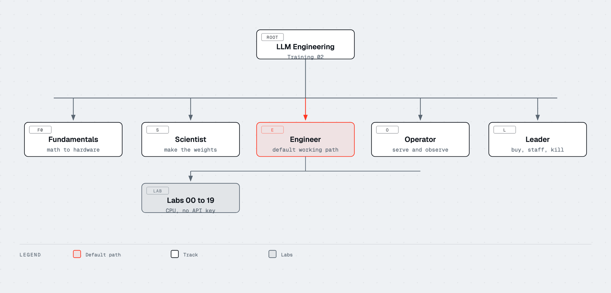
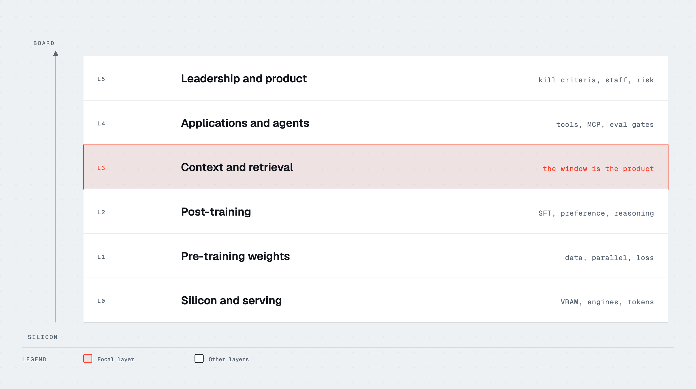
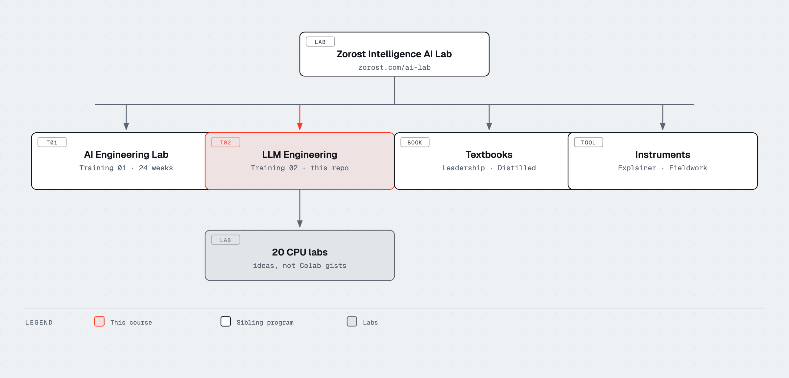

# LLM Engineering

[](LICENSE)
[](tracks/)
[](notebooks/)
[](https://github.com/zorost/AI-Engineering-Lab)

**[Start here](START-HERE.md)** ·
[How to choose a path](#pick-a-door) ·
[Five tracks](#the-five-tracks) ·
[Labs](notebooks/README.md) ·
[YouTube and courses](reference/YOUTUBE.md) ·
[Glossary](reference/GLOSSARY.md) ·
[Why this exists](docs/ASSESSMENT.md)

Developed by [Zorost Intelligence AI Lab](https://zorost.com/ai-lab) · Washington, DC ·
Training 02 on [zorost.com/ai-lab](https://zorost.com/ai-lab)

---

## What this is

**LLM Engineering** is a free, open course that teaches the full job of working
with large language models: how they are built, how they are adapted, how they
are shipped, how they are operated, and how a technical leader decides what to
fund. It is original writing, original diagrams, and original CPU-first labs
from [Zorost Intelligence AI Lab](https://zorost.com/ai-lab).

It sits next to [AI Engineering Lab](https://github.com/zorost/AI-Engineering-Lab)
(Training 01), which takes a beginner from Python to a governed production
lakehouse in 24 weeks. This repository is the specialist map of the LLM field
itself. Read that program if you need the weekly cadence and the freight case
study. Read this one if you need depth on tokens, training, alignment,
retrieval, agents, serving, cost, security, and the decisions around them.

There is no signup. MIT licensed. The required labs run on a laptop CPU with
no API key.

> The job is not "know the names of papers." The job is to choose a path,
> measure the result, and know why the other path would have failed.

## Pick a door



| If you are… | Open this first | Then do |
|---|---|---|
| New to machine learning | [START-HERE](START-HERE.md) then [Fundamentals](tracks/00-fundamentals/README.md) | Labs 00 to 03 |
| Training or adapting models | [Scientist](tracks/01-scientist/README.md) | Labs 04 to 08, 17 to 19 |
| Shipping products on models | [Engineer](tracks/02-engineer/README.md) | Labs 08 to 16 |
| Running models in production | [Operator](tracks/03-operator/README.md) | Labs 13, 15, 18 |
| Deciding budget, risk, and org | [Leader](tracks/04-leader/README.md) | The four leader modules, then the textbooks |

Do not start at agents if you cannot yet explain a token, a context window, and
an eval. The [decision diagram](assets/diagrams/choose-path.png) is the short
version of that rule.

## Clone it

```bash
git clone https://github.com/zorost/LLM-Engineering.git
cd LLM-Engineering
python3 -m pip install -r requirements.txt
python3 scripts/check.py
```

Then open [START-HERE.md](START-HERE.md). If you already write Python and have
trained a network, skip to the track table and take the Scientist or Engineer
door.

## The five tracks



Every concept in the public LLM-course tradition is here: mathematics, Python,
networks, classical NLP, architecture, pre-training, post-training data,
supervised fine-tuning, preference alignment, evaluation, quantization,
merging, multimodality, interpretability, test-time compute, APIs and local
runtimes, prompt engineering, structured output, vector stores, RAG, advanced
RAG, agents, inference optimization, deployment, and security.

The modules below also cover the gaps that list usually leaves: tokenizer
design, long context, mixture of experts, state-space hybrids, reasoning
models, distillation and speculative decoding, licenses and contamination,
context engineering, MCP and A2A, production evals, cost, observability,
governance, and the leadership decisions that make the rest of it worth doing.

### 0 · Fundamentals (optional, but not skippable if you are guessing)

[Track README](tracks/00-fundamentals/README.md)

| # | Module | What you can do after it |
|---|---|---|
| F1 | [Mathematics](tracks/00-fundamentals/01-mathematics.md) | Read a gradient, a matrix multiply, and a probability statement without bluffing |
| F2 | [Python and data](tracks/00-fundamentals/02-python-and-data.md) | Load, split, and plot a dataset, and know why leakage is fatal |
| F3 | [Neural networks](tracks/00-fundamentals/03-neural-networks.md) | Train a tiny network and name the failure (underfit, overfit, exploding) |
| F4 | [NLP before transformers](tracks/00-fundamentals/04-nlp-before-transformers.md) | Explain why bag-of-words dies on meaning, and what embeddings fixed |
| F5 | [Scaling, information, hardware](tracks/00-fundamentals/05-scaling-and-hardware.md) | Estimate tokens, FLOPs, and VRAM before you buy a box |

### 1 · The LLM scientist

[Track README](tracks/01-scientist/README.md) ·
[Pipeline diagram](assets/diagrams/scientist-pipeline.png)

How capable models are made. You do not need a GPU cluster to understand this
track. You do need it if you intend to reproduce frontier pre-training.

| # | Module | What you can do after it |
|---|---|---|
| S1 | [Architecture](tracks/01-scientist/01-architecture.md) | Trace text through tokenize, embed, attend, sample; know RoPE, GQA, MoE |
| S2 | [Pre-training](tracks/01-scientist/02-pre-training.md) | Describe data, parallelism, and the metrics that say a run is dying |
| S3 | [Post-training data](tracks/01-scientist/03-post-training-data.md) | Design an instruction or preference set, and filter it |
| S4 | [Supervised fine-tuning](tracks/01-scientist/04-supervised-fine-tuning.md) | Choose full FT vs LoRA vs QLoRA and name the parameters that matter |
| S5 | [Preference alignment](tracks/01-scientist/05-preference-alignment.md) | Contrast DPO, PPO, GRPO, ORPO, and when RL is worth the cost |
| S6 | [Evaluation](tracks/01-scientist/06-evaluation.md) | Build a harness that is not just a leaderboard screenshot |
| S7 | [Quantization](tracks/01-scientist/07-quantization.md) | Pick GGUF, GPTQ, AWQ, or bitsandbytes for a real constraint |
| S8 | [Merging, multimodal, interp](tracks/01-scientist/08-new-directions.md) | Merge, ablate, or condition on images without cargo-culting the tool |
| S9 | [Reasoning and test-time](tracks/01-scientist/09-reasoning-and-test-time.md) | Scale compute at decode time on purpose, not by accident |
| S10 | [Distillation and draft models](tracks/01-scientist/10-distillation-and-speculation.md) | Explain speculative decoding and why a draft model helps |
| S11 | [Licenses, contamination, data law](tracks/01-scientist/11-licenses-and-contamination.md) | Read a model card and a dataset card before you ship |
| S12 | [Interpretability and editing](tracks/01-scientist/12-interpretability.md) | Know what SAEs and activation steering can and cannot claim |

### 2 · The LLM engineer

[Track README](tracks/02-engineer/README.md) ·
[Stack diagram](assets/diagrams/engineer-stack.png)

How applications that *use* models are built. This is the default working path
for most readers of this course.

| # | Module | What you can do after it |
|---|---|---|
| E1 | [Running models](tracks/02-engineer/01-running-models.md) | Call an API or a local runtime, and constrain the output |
| E2 | [Vector storage](tracks/02-engineer/02-vector-storage.md) | Ingest, chunk, embed, and retrieve with a metric |
| E3 | [RAG](tracks/02-engineer/03-rag.md) | Ground an answer, cite it, and measure faithfulness |
| E4 | [Advanced RAG](tracks/02-engineer/04-advanced-rag.md) | Hybrid search, rerank, graphs, text-to-SQL, query rewrite |
| E5 | [Agents](tracks/02-engineer/05-agents.md) | Build a tool loop before you import a framework |
| E6 | [Inference optimization](tracks/02-engineer/06-inference-optimization.md) | KV cache, Flash Attention, batching, speculative decode |
| E7 | [Deployment](tracks/02-engineer/07-deployment.md) | Local, demo, server, and edge, with an honest cost line |
| E8 | [Security](tracks/02-engineer/08-security.md) | Prompt injection, poisoning, red teaming, logging of secrets |
| E9 | [Context, tools, MCP](tracks/02-engineer/09-context-and-mcp.md) | Pack a window, cache a prefix, expose a tool through MCP |
| E10 | [Evals in production](tracks/02-engineer/10-production-evals.md) | Gate a release on a suite, not a vibe |
| E11 | [Memory and conversation](tracks/02-engineer/11-memory.md) | Buffer, summarize, retrieve; know when each lies |
| E12 | [Platforms](tracks/02-engineer/12-platforms.md) | Azure, Vertex, Bedrock, Databricks, and open gateways |

### 3 · The LLM operator (the usual missing track)

[Track README](tracks/03-operator/README.md)

| # | Module | What you can do after it |
|---|---|---|
| O1 | [Serving engines](tracks/03-operator/01-serving-engines.md) | Choose vLLM, SGLang, TGI, llama.cpp, or MLX for a workload |
| O2 | [Reliability](tracks/03-operator/02-reliability.md) | Timeouts, retries, fallbacks, circuit breakers, idempotency |
| O3 | [Cost and capacity](tracks/03-operator/03-cost-and-capacity.md) | Tokens, QPS, VRAM, and the bill |
| O4 | [Observability](tracks/03-operator/04-observability.md) | Traces, eval samples, and privacy-safe logs |

### 4 · The LLM leader

[Track README](tracks/04-leader/README.md)

This track is the reason the course is a Zorost program rather than a notebook
zoo. It is written against the two textbooks and against the work the Lab
already ships.

| # | Module | What you can do after it |
|---|---|---|
| L1 | [Buy, build, retrieve, or fine-tune](tracks/04-leader/01-buy-build-retrieve.md) | Pick the cheapest move that hits the eval |
| L2 | [Teams and skills](tracks/04-leader/02-teams-and-skills.md) | Staff an LLM effort without cloning a research lab |
| L3 | [Risk and governance](tracks/04-leader/03-risk-and-governance.md) | Map NIST AI RMF and the EU AI Act onto a real system |
| L4 | [Portfolio and product](tracks/04-leader/04-portfolio.md) | Kill a demo that will never become a product |

## Labs

Twenty notebooks. All of them run on CPU. None of them require a paid key.
They exist so you can *break the idea*, not so you can screenshot a Colab GPU.

[Notebook index](notebooks/README.md) · [Tutorial notes](tutorials/README.md)

| Lab | Notebook | Concept |
|---|---|---|
| 00 | `00_environment_check.ipynb` | Install, versions, the check script |
| 01 | `01_tokenization_bpe.ipynb` | Byte-pair encoding from scratch |
| 02 | `02_attention.ipynb` | One-head attention on tiny tensors |
| 03 | `03_decoding_strategies.ipynb` | Greedy, temperature, top-k, nucleus |
| 04 | `04_chat_templates.ipynb` | Why a missing end token wrecks SFT |
| 05 | `05_lora_shapes.ipynb` | LoRA rank, alpha, and parameter count |
| 06 | `06_dpo_loss.ipynb` | Direct preference optimization on toy pairs |
| 07 | `07_quantization.ipynb` | Absmax and zero-point, with error |
| 08 | `08_embeddings_rag.ipynb` | Chunk, embed, retrieve, cite |
| 09 | `09_hybrid_retrieval.ipynb` | Sparse plus dense, then rerank |
| 10 | `10_react_agent.ipynb` | Thought, action, observation, without a framework |
| 11 | `11_structured_output.ipynb` | JSON schema as a contract |
| 12 | `12_eval_harness.ipynb` | A suite, a gate, an error bucket |
| 13 | `13_vram_and_cost.ipynb` | Memory math and token economics |
| 14 | `14_prompt_injection_defense.ipynb` | Attacks as test cases, not as a cookbook |
| 15 | `15_openai_compatible_client.ipynb` | One client, many backends |
| 16 | `16_speculative_decoding.ipynb` | Draft and verify on a toy alphabet |
| 17 | `17_moe_routing.ipynb` | Experts, gates, load balance |
| 18 | `18_kv_cache.ipynb` | Why the second token is cheaper |
| 19 | `19_scaling_laws.ipynb` | Loss vs compute, with honest limits |

Run one:

```bash
python3 -m jupyter notebook notebooks/00_environment_check.ipynb
```

Or execute them all headless after you trust `scripts/check.py`.

## Companion programs, books, and tools



This repository is one shelf in a public set. Use the others. Do not copy
client work into either.

| What | Where | Use it for |
|---|---|---|
| **AI Engineering Lab** (Training 01) | [github.com/zorost/AI-Engineering-Lab](https://github.com/zorost/AI-Engineering-Lab) · [zorost.com/ai-engineering-lab](https://zorost.com/ai-engineering-lab) | 24-week path from Python to Databricks, with a single case study |
| **Transformer Explainer** | [github.com/zorost/transformer-explainer](https://github.com/zorost/transformer-explainer) | In-browser attention, RoPE, GQA, KV cache, MoE |
| **30 days of Databricks** | [github.com/zorost/30-days-of-Databricks](https://github.com/zorost/30-days-of-Databricks) | Lakehouse literacy that the Engineer platforms module assumes |
| **AI Fieldwork** | [zorost.com/ai-lab/fieldwork](https://zorost.com/ai-lab/fieldwork) | Dated experiments: what held, what broke |
| **Open tools** | [github.com/zorost](https://github.com/zorost) · [zorost.com/ai-lab/open-source](https://zorost.com/ai-lab/open-source) | DocPrep-AI, MarkForge, yt2textbook, OneRead, SparkDuet, AlchemyLake |
| **The AI Leadership Textbook** | [Amazon](https://www.amazon.com/dp/B0HHTJHK5R) · [Author page](https://www.amazon.com/stores/Fereydun-Hashemipour/author/B0HHVZ1929) | Silicon to boardroom: 44 chapters, platforms, governance, playbooks |
| **AI Engineering Distilled** | [Amazon](https://www.amazon.com/dp/B0HHZM4QQS) | Seam notation for specifying LLM, RAG, and agent systems |

Full citations live in [reference/BOOKS.md](reference/BOOKS.md).
The public training register is [zorost.com/ai-lab/training](https://zorost.com/ai-lab/training).

## YouTube and other courses

A curated, dated map of lectures we actually send people to. Not a dump of
every thumbnail.

**Start with these, in this order:**

1. [3Blue1Brown, But what is a neural network?](https://www.youtube.com/watch?v=aircAruvnKk) then [the Transformer](https://www.youtube.com/watch?v=wjZofJX0v4M)
2. [Andrej Karpathy, Deep Dive into LLMs like ChatGPT](https://www.youtube.com/watch?v=7xTGNNLPyMI) then [Let's build GPT](https://www.youtube.com/watch?v=kCc8FmEb1nY) and [Let's build a tokenizer](https://www.youtube.com/watch?v=zduSFxRajkE)
3. [Stanford CS336, Language Modeling from Scratch (2026)](https://www.youtube.com/playlist?list=PLoROMvodv4rMqXOcazWaTUHhq-yembLCV) ([2025 playlist](https://www.youtube.com/playlist?list=PLoROMvodv4rOY23Y0BoGoBGgQ1zmU_MT_), [course site](https://cs336.stanford.edu/))
4. [Hugging Face NLP Course](https://huggingface.co/learn/nlp-course) then [LLM Course](https://huggingface.co/learn/llm-course) and [Agents Course](https://huggingface.co/learn/agents-course)
5. [fast.ai Practical Deep Learning](https://course.fast.ai/)

The full list, with why each item is there, is
[reference/YOUTUBE.md](reference/YOUTUBE.md). Outside courses we respect and
do not copy: [reference/COURSES.md](reference/COURSES.md).

## What is in the repository

```
LLM-Engineering/
├── START-HERE.md          # day one: install, order, when it breaks
├── tracks/                # the five tracks, one idea per file
├── tutorials/             # how each lab type is supposed to feel
├── notebooks/             # 20 CPU-first labs
├── reference/             # glossary, books, YouTube, papers, tools
├── assets/diagrams/       # Zorost diagrams (HTML source + PNG)
├── docs/                  # assessment of the field, study plans
├── scripts/               # check.py and diagram export
└── .github/               # conduct, security, issues, CI
```

## How we wrote this

The field already has a well-known public roadmap tradition. We read it,
including Maxime Labonne's widely used [llm-course](https://github.com/mlabonne/llm-course),
end to end. We kept the *coverage* (fundamentals, scientist, engineer) and
rewrote every explanation. We added the modules that 2024 to 2026 made
non-optional, we added an operator track and a leader track, and we added
labs you can run without a rented GPU.

We do not reproduce third-party course text, notebooks, or artwork. Citations
point at the original. The assessment of what was missing is
[docs/ASSESSMENT.md](docs/ASSESSMENT.md).

Diagrams use the Zorost house skin (PAPERG paper, INK type, LAVA accent) and
the Lab's editorial diagram system. HTML sources sit next to the PNGs so you
can change a label without redrawing from memory.

## Getting help

1. Read the error. The last line is usually the name of the problem.
2. Check that module's knowledge-check answers and the [glossary](reference/GLOSSARY.md).
3. Open a GitHub issue with the file path, what you ran, and the traceback.
4. Write **info@zorost.com** for security or conduct.

See [contributing](.github/CONTRIBUTING.md),
[code of conduct](.github/CODE_OF_CONDUCT.md), and
[security](.github/SECURITY.md).

## About Zorost Intelligence AI Lab

[Zorost Intelligence](https://zorost.com) designs, ships, and operates AI and
data platforms for organizations where accuracy, traceability, and compliance
are non-negotiable. This course is developed by the **AI Lab** and published
as Training 02. Training 01 is [AI Engineering Lab](https://github.com/zorost/AI-Engineering-Lab).

Questions: **info@zorost.com**.

## License

MIT. See [LICENSE](LICENSE). Learn freely, build freely, attribute
Zorost Intelligence.

---
© 2026 Zorost Intelligence LLC · [zorost.com](https://zorost.com) · [@ZorostAI](https://x.com/ZorostAI) · info@zorost.com
