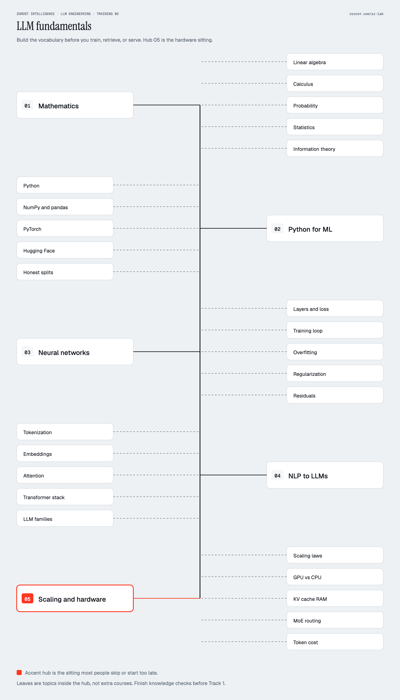

# Track 0 · Fundamentals

Optional only if you can already do the knowledge checks with the answers
hidden. If you are guessing, you are not optional.

This track is the floor under every later sentence in the course. It is
also the track people skip, then spend Scientist week two arguing with a
loss curve they cannot read.

  

Hub 05 is the hardware sitting. Public LLM courses often stop at NLP. Do
not. F5 is why S2 and S7 do not turn into shopping.

| Order | File | Lab | Roadmap hub |
|---|---|---|---|
| F1 | [Mathematics](01-mathematics.md) | none required; 3Blue1Brown is the lab | 01 Mathematics |
| F2 | [Python and data](02-python-and-data.md) | 00 | 02 Python for ML |
| F3 | [Neural networks](03-neural-networks.md) | 02 | 03 Neural networks |
| F4 | [NLP before transformers](04-nlp-before-transformers.md) | 01 after this, not before | 04 NLP to LLMs |
| F5 | [Scaling, information, hardware](05-scaling-and-hardware.md) | 13, 19 | 05 Scaling and hardware |

## Leaves on the poster

Every box on the image is a heading you can fail a knowledge check on.

| Hub | Leaves | Where the words live |
|---|---|---|
| 01 Mathematics | Linear algebra, calculus, probability, statistics, information theory | F1; information theory also in F5 |
| 02 Python for ML | Python, NumPy and pandas, PyTorch, Hugging Face, honest splits | F2 |
| 03 Neural networks | Layers and loss, training loop, overfitting, regularization, residuals | F3 |
| 04 NLP to LLMs | Tokenization, embeddings, attention, transformer stack, LLM families | F4, then S1 |
| 05 Scaling and hardware | Scaling laws, GPU vs CPU, KV cache RAM, MoE routing, token cost | F5; labs 13 and 19 |

When F5 is easy, go to [Scientist](../01-scientist/README.md) or
[Engineer](../02-engineer/README.md). Do not go to agents.
