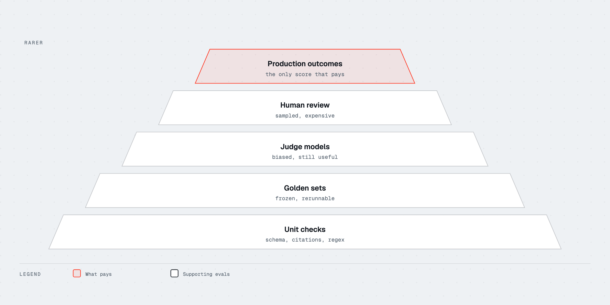

# S6 · Evaluation

## Why it exists

Training without evaluation is a GPU receipt. Evaluation without a
threat model is a screenshot. This module is how you measure a
checkpoint so a later one can lose.

## The idea

### Goodhart, first

When a number becomes a target, it stops being a measure. MMLU,
HumanEval, and Arena Elo are useful **until** you train on them,
prompt-tune on them, or select twenty seeds and report the best.
The scientist's job is a **suite** plus an **error process**, not a
single headline.

Write the use case as a sentence: "7B instruct, English support
answers, citations required, no tool use." That sentence picks the
tasks. A general leaderboard does not.

### Contamination

Public exams live in crawls, in synthetic teachers, in blog posts
that paste the full multiple-choice item. A model that "gains 2%
MMLU" after SFT on web-instruct data may have **seen the items**.

Mitigations you can actually do:

- Decontaminate train against the eval (S3, S11): MinHash and
  semantic near-dup.
- Prefer **held-out, dated, or privately authored** items for the
  number you ship on.
- Treat classic static suites as **regression canaries**, not as
  proof of intelligence.

If you cannot rerun the eval with your tokenizer, your template,
and your decoding settings, you do not own the number.

### Harnesses

Two public ones worth installing:

- **[lm-evaluation-harness](https://github.com/EleutherAI/lm-evaluation-harness)**
  (EleutherAI): the long-lived standard for MMLU-style, few-shot,
  loglikelihood and generate-until tasks. Painful YAML, honest
  coverage.
- **[lighteval](https://github.com/huggingface/lighteval)**
  (Hugging Face): newer, used in FineWeb ablations and Open LLM
  Leaderboard-style runs. Easier HF integration.

Both will lie if you:

- Change few-shot examples and keep the old name.
- Use chat templates on a base model (or skip them on an instruct
  model).
- Sample with T=0.8 on a task defined as greedy / loglikelihood.

Pin versions. Log the commit hash of the harness, the task yaml,
the seed, and the template. Lab 12 is a tiny suite with a gate,
not a leaderboard clone.

### Human and judge evals

**Chatbot Arena** ([lmarena.ai](https://lmarena.ai/)) is pairwise
human preference at scale. Elo is a crowd, with prompt mix,
position bias, and style bias (long, markdown, hedges). Use it as
one signal for **general chat**. Do not use it as the release gate
for a legal assistant.

**LLM-as-judge** (a strong model grades a weaker one) is cheaper
and more reproducible than Arena, and it inherits the judge's
tastes. Rubrics beat "score 1-10." Pairwise with swapped order
beats pointwise. Calibrate the judge on a human-labeled slice or
you are optimizing for the judge's prose.

A judge is an eval model. It can be contaminated too.

### Task evals that are not MMLU

Static multiple-choice is easy to overfit. Keep a few **task-shaped**
benchmarks in the suite so the failure looks like the product:

| Eval | What it stresses |
|---|---|
| **[IFEval](https://arxiv.org/abs/2311.07911)** | Instruction following with checkable constraints ("exactly three bullets") |
| **[LiveCodeBench](https://livecodebench.github.io/)** | Coding problems dated after training cuts, harder to memorize |
| **[SWE-bench](https://www.swebench.com/)** | Real repo issues; needs agents and tests, not a single completion |

These are examples. Your product may need RAG faithfulness (E3),
tool-call schema validity (E5), or a private golden set. The
pattern is: **automatic checker where possible**, humans on the
slice the checker cannot see.

### Error analysis

A 71 vs 69 on MMLU is usually noise (F1). A 71 with a new cluster
of failures is a finding.

Process:

1. Sample N failures (and some successes). Stratify by task.
2. Bucket: refusal, format, factual, reasoning chain, tokenizer
   garbage, template, tool.
3. Count the buckets. Fix the largest bucket with data or decoding,
   not with a new paper.
4. Re-run only the affected slice plus a small regression pack.

If you cannot name the buckets, you are not evaluating. You are
collecting scores.

Release gates belong in Engineer (E10). This track's standard is:
every Scientist experiment names the suite, the contamination
story, and one qualitative sample that would embarrass you.

## The gap most roadmaps leave

They link the Open LLM Leaderboard and stop. Missing:

- Goodhart as a planning constraint, not a witty aside.
- Contamination as a default hypothesis for small gains.
- Harness pins (template, seed, commit).
- Judges as biased annotators.
- Error buckets that drive the next SFT mix.

Leaderboards are advertising. Harnesses plus buckets are
engineering.

## Practice

Lab `notebooks/12_eval_harness.ipynb` (shared with Engineer). Build
a three-task suite: one exact-match, one constraint check in the
IFEval spirit, one judge rubric. Add a gate that fails the build
if exact-match drops more than a threshold you chose before you
saw the numbers.

Then take three public model cards and write, for each, whether
the reported MMLU could have been contaminated and whether the
card says how they evaled chat vs base.

## Watch and read

- EleutherAI, [lm-evaluation-harness](https://github.com/EleutherAI/lm-evaluation-harness)
- Hugging Face, [lighteval](https://github.com/huggingface/lighteval), Open LLM Leaderboard docs, [LLM course eval pages](https://huggingface.co/learn/llm-course)
- [Chatbot Arena](https://lmarena.ai/)
- Zhou et al., [IFEval](https://arxiv.org/abs/2311.07911); [LiveCodeBench](https://livecodebench.github.io/); [SWE-bench](https://www.swebench.com/)
- Stanford CS336, evaluation lectures
- Lilian Weng, [extrinsic eval notes in the LLM posts](https://lilianweng.github.io/posts/2023-01-27-rlhf/)
- Karpathy, Deep Dive (eval / contamination remarks)
- Raschka, evaluation chapters in *Build a Large Language Model (From Scratch)*

## Knowledge check

1. State Goodhart's law as it applies to MMLU.
2. Why is a 0.7% MMLU gain usually not a ship decision?
3. What must you pin for a harness run to be comparable next month?
4. What failure mode does IFEval catch that MMLU does not?
5. Why is Arena Elo a weak gate for a domain product?

Answers

1. Once MMLU is the objective (train on it, select on it, tune
   prompts on it), the score stops estimating general knowledge
   and starts estimating how well you targeted the benchmark.
2. Sample noise, prompt format, contamination, and seed dominate
   that scale. Error buckets and a held-out task decide.
3. Harness commit, task definitions, few-shot pack, chat template,
   decoding, seed, and the exact checkpoint hash.
4. Whether the model obeyed checkable instructions (length, format,
   keyword constraints), not whether it picked A/B/C/D on a quiz.
5. Arena measures crowd chat preference, with style bias. A domain
   product needs task checkers and expert review on its own
   distribution.

