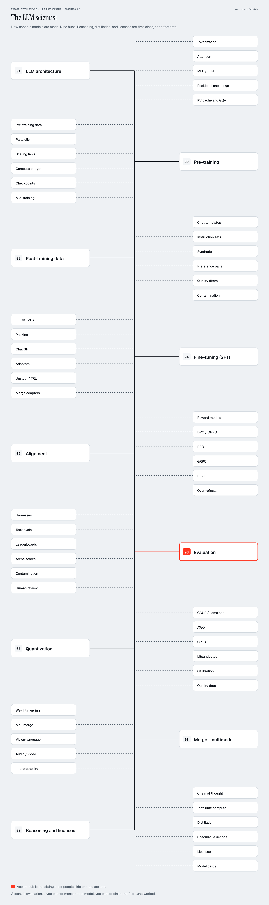
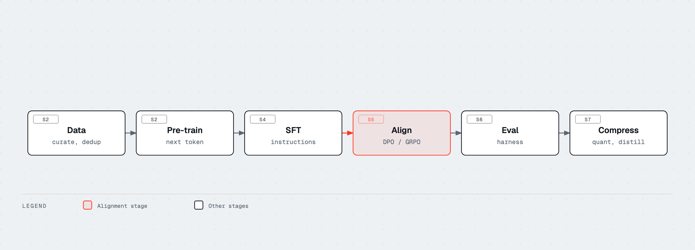

# Track 1 · The LLM scientist

How capable models are made. You read this track to train, adapt, or
evaluate weights with a working picture of the pipeline, not a list of
paper titles. You do not need a GPU cluster to finish the modules. You
do need one if you intend to reproduce frontier pre-training.

This is Training 02, [LLM Engineering](../../README.md), by
[Zorost Intelligence AI Lab](https://zorost.com/ai-lab). Training 01 is
[AI Engineering Lab](https://github.com/zorost/AI-Engineering-Lab).
The in-browser companion for S1 is
[transformer-explainer](https://github.com/zorost/transformer-explainer).
The textbooks that sit next to Track 4 are
[The AI Leadership Textbook](https://www.amazon.com/dp/B0HHTJHK5R) and
[AI Engineering Distilled](https://www.amazon.com/dp/B0HHZM4QQS)
([author page](https://www.amazon.com/stores/Fereydun-Hashemipour/author/B0HHVZ1929)).
Questions: info@zorost.com.

If [Fundamentals](../00-fundamentals/README.md) still has unanswered
knowledge checks, finish those first. If you skip F5, S2 and S7 will
feel like shopping.

  

Nine hubs. Hubs 08 and 09 are the expansion past a single "new trends"
column: merge and multimodal stay together; reasoning, distillation, and
licenses get their own hub and their own modules (S9 to S12). The lava
hub is evaluation. If you cannot measure the model, you cannot claim the
fine-tune worked.

## Who this track is for

- You will fine-tune, merge, quantize, or evaluate open weights.
- You need to read a training paper and know which knob it turned.
- You ship products (Engineer) but keep losing arguments about why the
  base model will not magically become a reasoner after one LoRA.

If you only call an API, start at [Engineer](../02-engineer/README.md).
Come back here for S1, S6, S7, and S11. Those four still pay off when
you never train.

Why this course exists, and what the public hub genre leaves out:
[docs/ASSESSMENT.md](../../docs/ASSESSMENT.md).

## Hardware

| Work | Machine |
|---|---|
| All required labs for this track | Laptop CPU, 8 GB RAM |
| Reading every module | same laptop |
| LoRA on a 1B to 8B instruct model | 16 GB unified memory or a 12 GB GPU |
| Full SFT of 7B+ | 24 GB+ VRAM, or ZeRO/FSDP on a rented box |
| Preference RL (GRPO/PPO) at 7B+ | a serious GPU node; see S5 |
| Pre-training from scratch | a cluster; S2 teaches the map, not the weekend |

Labs in this repository stay CPU-first on purpose. A Colab GPU is
optional later work, never a gate. Cost math lives in F5, lab 13, and
the [Operator](../03-operator/README.md) track.

## Modules

| Order | File | Labs |
|---|---|---|
| S1 | [Architecture](01-architecture.md) | 01, 02, 03, 17, 18 |
| S2 | [Pre-training](02-pre-training.md) | 19 |
| S3 | [Post-training data](03-post-training-data.md) | 04 |
| S4 | [Supervised fine-tuning](04-supervised-fine-tuning.md) | 05 |
| S5 | [Preference alignment](05-preference-alignment.md) | 06 |
| S6 | [Evaluation](06-evaluation.md) | 12 (shared with Engineer) |
| S7 | [Quantization](07-quantization.md) | 07 |
| S8 | [Merging and multimodal](08-new-directions.md) | none required |
| S9 | [Reasoning and test-time](09-reasoning-and-test-time.md) | none required |
| S10 | [Distillation and speculation](10-distillation-and-speculation.md) | 16 |
| S11 | [Licenses and contamination](11-licenses-and-contamination.md) | three model cards |
| S12 | [Interpretability](12-interpretability.md) | none required |

S8 is merging and multimodal. Reasoning is S9. Distillation is S10.
Interpretability is S12. Do not treat those four as one "new trends"
bucket.

## Leaves on the poster

| Hub | Leaves | Module |
|---|---|---|
| 01 Architecture | Tokenization, attention, MLP/FFN, positional encodings, KV cache and GQA | S1 |
| 02 Pre-training | Data, parallelism, scaling laws, compute, checkpoints, mid-training | S2 |
| 03 Post-training data | Chat templates, instruction sets, synthetic data, preference pairs, filters, contamination | S3 |
| 04 Fine-tuning (SFT) | Full vs LoRA, packing, chat SFT, adapters, Unsloth/TRL, merge adapters | S4 |
| 05 Alignment | Reward models, DPO/ORPO, PPO, GRPO, RLAIF, over-refusal | S5 |
| 06 Evaluation | Harnesses, task evals, leaderboards, arena, contamination, human review | S6 |
| 07 Quantization | GGUF, AWQ, GPTQ, bitsandbytes, calibration, quality drop | S7 |
| 08 Merge · multimodal | Weight merging, MoE merge, vision-language, audio/video, interpretability | S8, S12 |
| 09 Reasoning and licenses | Chain of thought, test-time compute, distillation, speculative decode, licenses, model cards | S9, S10, S11 |

Twelve sittings for this track: [docs/STUDY-PLANS.md](../../docs/STUDY-PLANS.md),
Plan B.

When S12 is easy, open [Engineer](../02-engineer/README.md) unless your
job is weights. Do not start at agents.
