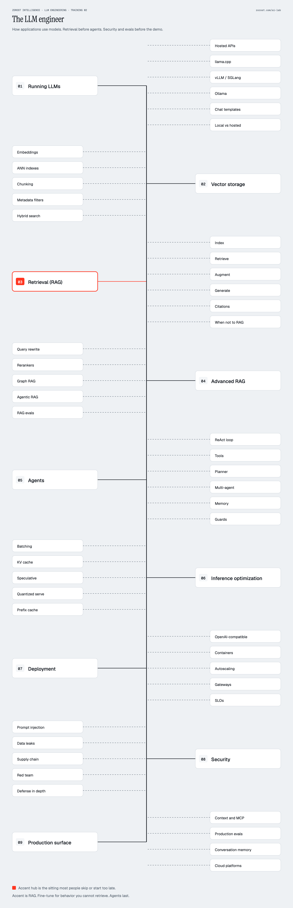
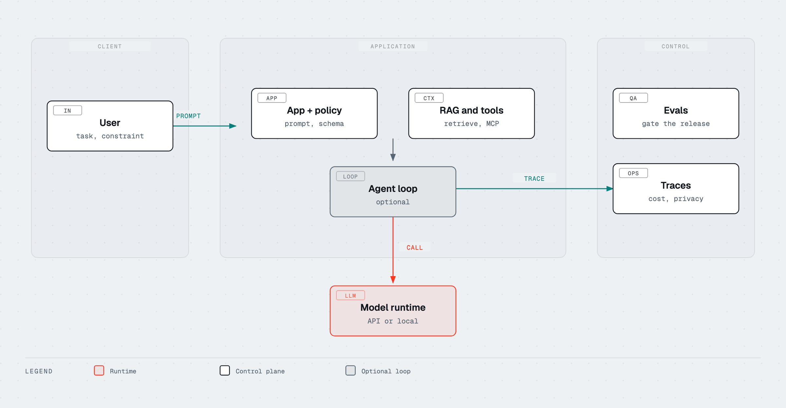
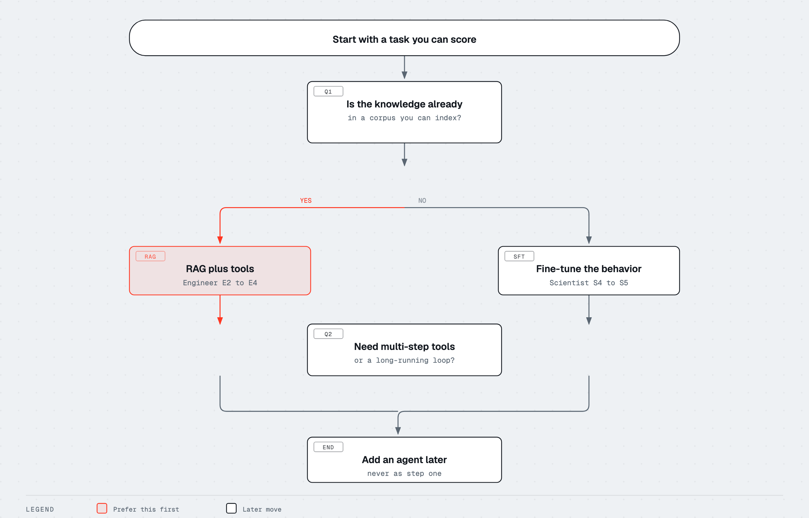

# Track 2 · The LLM engineer

This is the default working path. Most people who open this course
are here to ship a product that *uses* a model, not to pre-train one.
Scientist is how weights are made. Engineer is how an application
calls those weights, grounds them, measures them, and puts them behind
a contract.

  

Nine hubs. Hub 03 (RAG) is the lava sitting: fine-tune for behavior you
cannot retrieve; agents last. Hub 09 is the production surface public
engineer posters usually leave as a caption: context and MCP, production
evals, memory, platforms.

Do not start at agents. If you cannot yet explain a token, a context
window, and an eval, go back to [Fundamentals](../00-fundamentals/README.md)
and [S1 Architecture](../01-scientist/01-architecture.md). Then return.

| Order | File | Labs |
|---|---|---|
| E1 | [Running models](01-running-models.md) | 03, 04, 11, 15 |
| E2 | [Vector storage](02-vector-storage.md) | 08 |
| E3 | [RAG](03-rag.md) | 08 |
| E4 | [Advanced RAG](04-advanced-rag.md) | 09 |
| E5 | [Agents](05-agents.md) | 10 |
| E6 | [Inference optimization](06-inference-optimization.md) | 16, 18 |
| E7 | [Deployment](07-deployment.md) | 15 |
| E8 | [Security](08-security.md) | 14 |
| E9 | [Context, tools, MCP](09-context-and-mcp.md) | 04, 11, 15 |
| E10 | [Evals in production](10-production-evals.md) | 12 |
| E11 | [Memory and conversation](11-memory.md) | 08 |
| E12 | [Platforms](12-platforms.md) | 15; Training 01 weeks 18 to 24 |

## Leaves on the poster

| Hub | Leaves | Module |
|---|---|---|
| 01 Running LLMs | Hosted APIs, llama.cpp, vLLM/SGLang, Ollama, chat templates, local vs hosted | E1 |
| 02 Vector storage | Embeddings, ANN indexes, chunking, metadata filters, hybrid search | E2 |
| 03 Retrieval (RAG) | Index, retrieve, augment, generate, citations, when not to RAG | E3 |
| 04 Advanced RAG | Query rewrite, rerankers, graph RAG, agentic RAG, RAG evals | E4 |
| 05 Agents | ReAct, tools, planner, multi-agent, memory, guards | E5 |
| 06 Inference | Batching, KV cache, speculative, quantized serve, prefix cache | E6 |
| 07 Deployment | OpenAI-compatible, containers, autoscaling, gateways, SLOs | E7 |
| 08 Security | Prompt injection, data leaks, supply chain, red team, defense in depth | E8 |
| 09 Production surface | Context and MCP, production evals, conversation memory, cloud platforms | E9 to E12 |

## Default path

Twelve sittings is [Plan A](../../docs/STUDY-PLANS.md). In this
repository that means:

1. E1, then E9. A call you cannot constrain is not an API.
2. E2 and E3 together. Retrieval is one pipeline, not two hobbies.
3. E4 only after you can cite a miss in lab 08.
4. E5 from scratch (lab 10) before any framework README.
5. E8 and E10 before you demo. Security and evals are release work.
6. E6 and E7 when latency or a bill shows up.
7. E11 when a chat product starts lying about last Tuesday.
8. E12 when a cloud, not a laptop, is the runtime.

Skip E6 if you will only call a hosted API and never serve weights.
Do not skip E8 or E10. Those two are why this is engineering.

When serving, SLOs, and the token bill are the job, continue in
[Operator](../03-operator/README.md). That track is the person on
call. This track ends at a working system; Operator keeps it up.

Hands-on cloud work lives in
[AI Engineering Lab](https://github.com/zorost/AI-Engineering-Lab)
weeks 18 to 24. E12 names the platforms. It does not copy those
notebooks.

Companions for this track: [transformer-explainer](https://github.com/zorost/transformer-explainer)
(KV cache, GQA), [30 days of Databricks](https://github.com/zorost/30-days-of-Databricks)
(lakehouse literacy E12 assumes), the public lab at
[zorost.com/ai-lab](https://zorost.com/ai-lab), and the two textbooks
on the [author page](https://www.amazon.com/stores/Fereydun-Hashemipour/author/B0HHVZ1929):
[The AI Leadership Textbook](https://www.amazon.com/dp/B0HHTJHK5R) and
[AI Engineering Distilled](https://www.amazon.com/dp/B0HHZM4QQS).

Questions: **info@zorost.com**.
