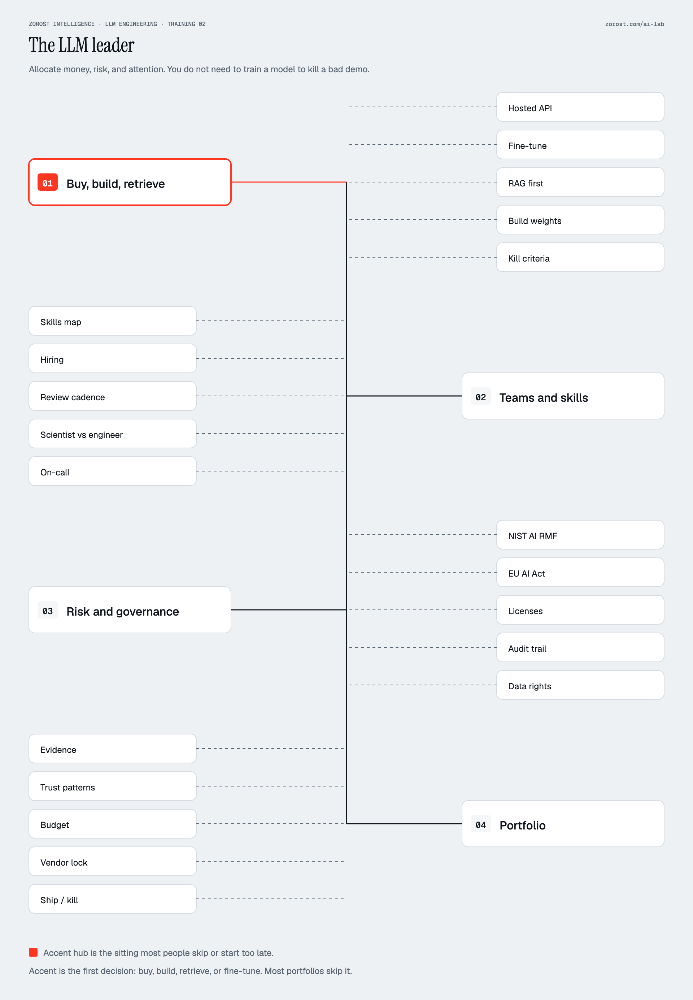

# Track 4 · Leader

This track is for people who allocate money, risk, and attention. You
do not need to train a model. You do need to know which move is
cheapest for a stated eval, who to hire, what a regulator will ask,
and when to kill a demo.

  

The lava hub is the first decision: buy, build, retrieve, or fine-tune.
Most portfolios skip it and start at a vendor demo.

The four modules are written against two textbooks by Fereydun
Hashemipour, independently published, and against a public skills map
from Andrew Ng / DeepLearning.AI. **Zorost Intelligence is not
affiliated with Andrew Ng, DeepLearning.AI, Stanford, or the third-party
publishers named below.** The textbooks are Zorost Lab books. The skills
map is not. Use both. Do not treat either as a vendor certificate.

| Order | File | Read with |
|---|---|---|
| L1 | [Buy, build, retrieve, or fine-tune](01-buy-build-retrieve.md) | *The AI Leadership Textbook*; *AI Engineering Distilled* (Boundary and Context views) |
| L2 | [Teams and skills](02-teams-and-skills.md) | Ng, [The AI Engineering Skills Map](https://www.deeplearning.ai/the-batch/the-ai-engineering-skills-map) (The Batch, issue 366, 2026); Distilled on shaping work |
| L3 | [Risk and governance](03-risk-and-governance.md) | NIST AI RMF 1.0; EU AI Act summaries from official sources; Leadership Textbook governance chapters |
| L4 | [Portfolio and product](04-portfolio.md) | Distilled, Evidence and Trust-family patterns; Leadership Textbook portfolio chapters |

## Leaves on the poster

| Hub | Leaves | Module |
|---|---|---|
| 01 Buy, build, retrieve | Hosted API, fine-tune, RAG first, build weights, kill criteria | L1 |
| 02 Teams and skills | Skills map, hiring, review cadence, scientist vs engineer, on-call | L2 |
| 03 Risk and governance | NIST AI RMF, EU AI Act, licenses, audit trail, data rights | L3 |
| 04 Portfolio | Evidence, trust patterns, budget, vendor lock, ship / kill | L4 |

Full citations: [reference/BOOKS.md](../../reference/BOOKS.md).

No GPU. Optional labs: skim S6 and E10 so "eval" is not a foreign
word, then walk Engineer only as far as E3 if you need to see RAG
before you fund it.

Study plan C in [docs/STUDY-PLANS.md](../../docs/STUDY-PLANS.md) is
four sittings.
